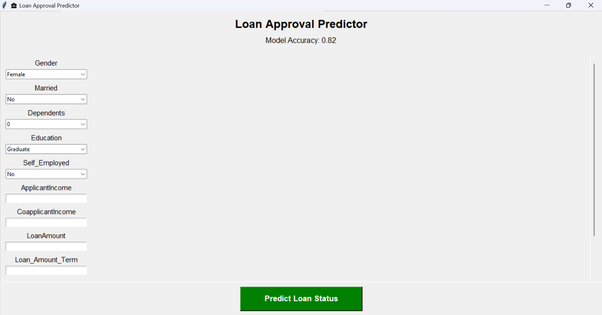
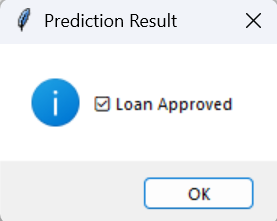
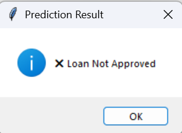

# Loan Predictor

This is a simple project to predict if a loan will be approved or not.

## About

This project uses a machine learning model to check loan approval based on information like applicant income, co-applicant income, loan amount, credit history, and other details. The model will give a **yes** or **no** answer for loan approval.

## How to Use

1. Clone this repository: `git clone https://github.com/Devakinandan-Sanapala/Loan-Predictor.git`  
2. Go to the project folder: `cd Loan-Predictor`  
3. Install the required Python packages: `pip install -r requirements.txt`  
4. Run the main program: `python main.py`  
5. Enter the required details and check if the loan will be approved.

## Demo

For example, if you enter Applicant Income: 5000, Co-applicant Income: 2000, Loan Amount: 150000, Credit History: 1, the model might say: **Loan Approved: Yes**

## Files

- `app.py` - main program to run the prediction  
- `model.pkl` - trained machine learning model  
- `requirements.txt` - all required Python packages  

## Images

## Notes

- Make sure you have Python installed.  
- This is a simple project for learning purposes.

## Author

- Ramidi Sharan Tej Reddy
